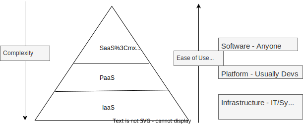

# Cloud Service Models

## Car Metaphor

- [[Infrastructure as a Service]] is like Leasing a Car
- [[Platform as a Service]] is like Renting a Car
- [[Software as a Service]] is like calling a Taxi or Uber

## [[Infrastructure as a Service]]

Cloud provider manages the physical resources - data centers, cooling, power, networking, security, servers and storage.
