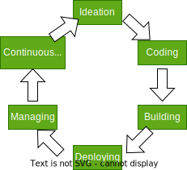

# DevOps

A collaborative approach that allows the following teams to collaborate to continuously deliver software:

- Business owners
- Development
- Operations
- Quality Assurance

Applies agile and lean thinking principles to all stakeholders, including customers, suppliers and partners

Improves productivity through:

- Accelerated feedback cycles
- Unified measurements and collaboration
- Reduced overhead, duplication and rework

## Benefits

- Devs can produce software in short iterations
- A continuous delivery of new features and bug fixes in rapid cycles
- Businesses can seize market opportunities
- Reduces time to include customer feedback in products

## Process

- Continuous Delivery - #CD
  - Small, well-designed, high-quality increments of software to the customers
  - Continuous delivery ensures that code changes are always in a state that can be released immediately. This state allows organizations to deploy software anytime with minimal manual intervention. Tools like Jenkins and Bamboo facilitate the automation of build, test, and deployment processes.
- Continuous Integration - #CI
  - Creating packaged builds of the code changes released as immutable images
    - Immutable meaning when modifications are needed, the entire unit is replaced
    - Developers integrate their code changes into a shared repository frequently, ensuring early detection of integration issues. Version control systems like Git and Subversion support this process.
- Continuous Deployment - #CDep
  - Progressing each new packaged build through the deployment cycle as rapidly as possible
  - Continuous deployment takes automation further, enabling organizations to automatically deploy software changes into production environments after passing the necessary tests.
- Continuous Monitoring - #CM
  - Help devs understand performance and availability of the applications, even before they are deployed to production
  - Continuous monitoring provides real-time insights into application and infrastructure performance, allowing organizations to detect issues promptly and take proactive measures. Tools like Prometheus and ELK Stack are commonly used for monitoring in DevOps.
- Delivery Pipeline
  - Automated sequence of steps that involves the stages of:

## DevOps in the context of [[Cloud Computing]]

De
